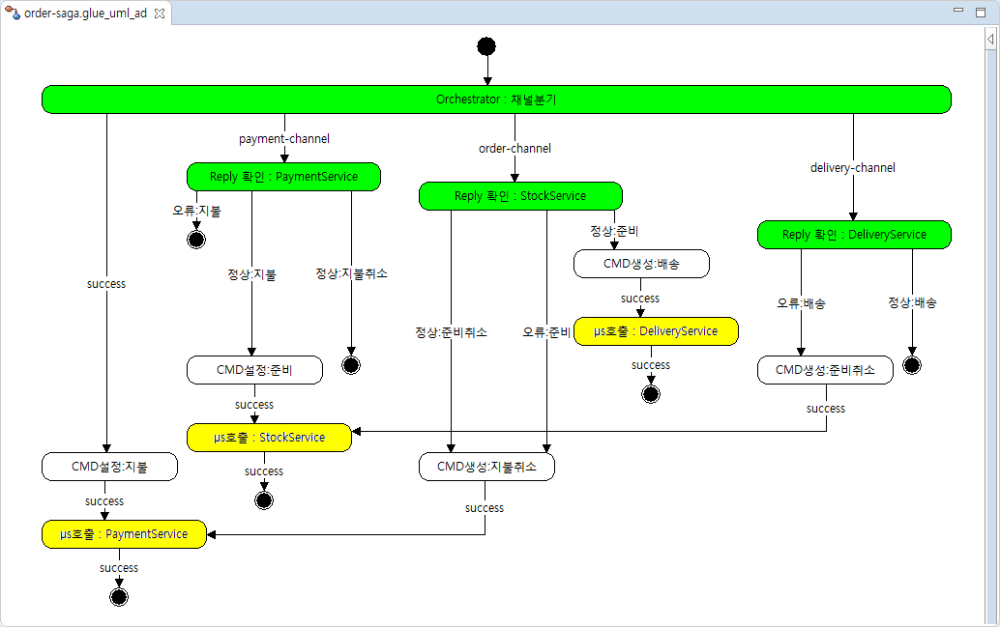

# Saga 패턴 적용

2개의 profile 사용가능합니다.
- saga
- saga-cloud

saga-parent는 다음을 구현합니다.

 

## how to run

```bash
$ cd apache-activemq-5.15.7/bin
$ activemq start
```

```bash
$ git clone https://github.com/poscoict-glueframework/glue-examples.git
$ cd glue-examples/saga-parent
$ mvn clean package
$ #mvn clean package -Psaga
$ #mvn clean package -Psaga-cloud
$ java -jar catering-pass-order/target/catering-pass-order.jar
$ java -jar catering-pass-payment/target/catering-pass-payment.jar
$ java -jar catering-pass-stock/target/catering-pass-stock.jar
$ java -jar catering-pass-delivery/target/catering-pass-delivery.jar
```

### Customizing

activemq 실행 명령어 예시입니다. [참고](https://jinfromkorea.github.io/articles/2018-11/activemq)

```bash
$ ~/Desktop/apache-activemq-5.15.7/bin/activemq start  # ActiveMq
```
mariadb 확인명령어 예시입니다. [참고](https://jinfromkorea.github.io/articles/2018-11/mariadb)

```bash
$ systemctl status mariadb                             # MariaDB
```

maven 실행 예시입니다. 

```bash
$ cd glue-examples/saga-parent/catering-pass-order              # 이동
$ touch application.yml                                         # application.yml 생성
$ mvn spring-boot:run -Dspring.config.location=application.yml  # application 실행
```

application.yml 파일 예시입니다.

```yml
server:
  port: 8081
logging:
  level: 
    ROOT: WARN
    com.poscoict: TRACE
    org.springframework.boot.web.embedded.tomcat.TomcatWebServer: INFO
spring:
  activemq:
    broker-url: tcp://192.168.41.81:61616
    user: admin
    password: admin
  datasource:
    url: jdbc:mysql://192.168.41.81:3306/catering_pass_order
    username: user.order
    password: password
    driver-class-name: org.mariadb.jdbc.Driver
  jpa:
    hibernate:
      ddl-auto: update
    database: mysql
    show-sql: false
    properties:
      hibernate:
        format_sql:true
```