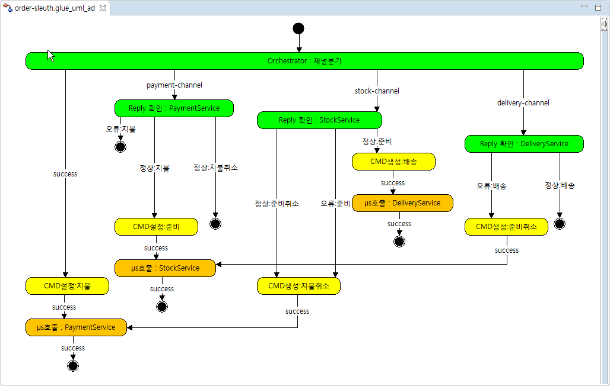

# Zipkin 적용

2개의 profile 사용가능합니다.
- slueth
- sleuth-cloud

sleuth-parent는 다음을 구현합니다.

 

## how to run

```bash
$ java -jar zipkin-server-2.12.0-exec.jar
```

```bash
$ cd kafka_2.12-2.1.0
$ bin/zookeeper-server-start.sh config/zookeeper.properties
$ bin/kafka-server-start.sh config/server.properties
```

```bash
$ git clone https://github.com/poscoict-glueframework/glue-examples.git
$ cd glue-examples/sleuth-parent
$ mvn clean package
$ #mvn clean package -Psleuth
$ #mvn clean package -Psleuth-cloud
$ java -jar catering-pass-order/target/catering-pass-order.jar
$ java -jar catering-pass-payment/target/catering-pass-payment.jar
$ java -jar catering-pass-stock/target/catering-pass-stock.jar
$ java -jar catering-pass-delivery/target/catering-pass-delivery.jar
$
$ #기타
$ mvn spring-boot:run -Psleuth-cloud -Dspring-boot.run.profiles=yujin
```
## zipkin

sleuth-order-api 의 로그 일부는 다음과 같습니다. 

```bash
2019-01-23 10:29:46.002  INFO [sleuth-order-api,e0e18d1d8ead94f9,e0e18d1d8ead94f9,true] 4388 --- [io-9201-exec-10] c.poscoict.cateringpass.OrderController  : POST /order/chaining/success
2019-01-23 10:29:46.018  INFO [sleuth-order-api,e0e18d1d8ead94f9,e0e18d1d8ead94f9,true] 4388 --- [io-9201-exec-10] c.poscoict.cateringpass.OrderController  : @RequestParam userId=yujin
2019-01-23 10:29:46.018  INFO [sleuth-order-api,e0e18d1d8ead94f9,e0e18d1d8ead94f9,true] 4388 --- [io-9201-exec-10] c.poscoict.cateringpass.OrderController  : @RequestParam takeOutId=sandwich
2019-01-23 10:29:46.018  INFO [sleuth-order-api,e0e18d1d8ead94f9,e0e18d1d8ead94f9,true] 4388 --- [io-9201-exec-10] c.poscoict.cateringpass.OrderController  : Tracer{currentSpan=e0e18d1d8ead94f9/e0e18d1d8ead94f9, finishedSpanHandler=org.springframework.cloud.sleuth.autoconfig.TraceAutoConfiguration$$Lambda$409/511576390@557d5e95}
2019-01-23 10:29:46.033  INFO [sleuth-order-api,e0e18d1d8ead94f9,e0e18d1d8ead94f9,true] 4388 --- [io-9201-exec-10] c.poscoict.cateringpass.OrderController  : RealSpan(e0e18d1d8ead94f9/e0e18d1d8ead94f9)
2019-01-23 10:29:46.689  INFO [sleuth-order-api,e0e18d1d8ead94f9,e0e18d1d8ead94f9,true] 4388 --- [io-9201-exec-10] c.poscoict.cateringpass.OrderController  : http://localhost:9202/payment/chaining/{testCase}
2019-01-23 10:29:46.689  INFO [sleuth-order-api,e0e18d1d8ead94f9,e0e18d1d8ead94f9,true] 4388 --- [io-9201-exec-10] c.poscoict.cateringpass.OrderController  : http://localhost:9202/payment/chaining/{testCase} orderId=5df216bc-1eae-11e9-b5bf-f1463bc062b7
2019-01-23 10:29:46.704  INFO [sleuth-order-api,e0e18d1d8ead94f9,e0e18d1d8ead94f9,true] 4388 --- [io-9201-exec-10] c.poscoict.cateringpass.OrderController  : http://localhost:9202/payment/chaining/{testCase} takeOutId=sandwich
2019-01-23 10:29:46.704  INFO [sleuth-order-api,e0e18d1d8ead94f9,e0e18d1d8ead94f9,true] 4388 --- [io-9201-exec-10] c.poscoict.cateringpass.OrderController  : http://localhost:9202/payment/chaining/{testCase} userId=yujin
2019-01-23 10:29:46.704  INFO [sleuth-order-api,e0e18d1d8ead94f9,e0e18d1d8ead94f9,true] 4388 --- [io-9201-exec-10] c.poscoict.cateringpass.OrderController  : http://localhost:9202/payment/chaining/{testCase} testCase=success


2019-01-23 10:29:50.401  INFO [sleuth-order-api,e0e18d1d8ead94f9,9f4c027c76d70034,true] 4388 --- [container-0-C-1] onsumer$$EnhancerBySpringCGLIB$$cb2222a6 : KAFKA /payment-service
2019-01-23 10:29:50.417  INFO [sleuth-order-api,e0e18d1d8ead94f9,9f4c027c76d70034,true] 4388 --- [container-0-C-1] onsumer$$EnhancerBySpringCGLIB$$cb2222a6 : @Payload orderId=5df216bc-1eae-11e9-b5bf-f1463bc062b7
2019-01-23 10:29:50.433  INFO [sleuth-order-api,e0e18d1d8ead94f9,9f4c027c76d70034,true] 4388 --- [container-0-C-1] onsumer$$EnhancerBySpringCGLIB$$cb2222a6 : @Payload channel-message=지불 성공
2019-01-23 10:29:50.448  INFO [sleuth-order-api,e0e18d1d8ead94f9,9f4c027c76d70034,true] 4388 --- [container-0-C-1] onsumer$$EnhancerBySpringCGLIB$$cb2222a6 : @Payload takeOutId=sandwich
2019-01-23 10:29:50.464  INFO [sleuth-order-api,e0e18d1d8ead94f9,9f4c027c76d70034,true] 4388 --- [container-0-C-1] onsumer$$EnhancerBySpringCGLIB$$cb2222a6 : @Payload userId=yujin
2019-01-23 10:29:50.479  INFO [sleuth-order-api,e0e18d1d8ead94f9,9f4c027c76d70034,true] 4388 --- [container-0-C-1] onsumer$$EnhancerBySpringCGLIB$$cb2222a6 : @Payload testCase=success
2019-01-23 10:29:50.511  INFO [sleuth-order-api,e0e18d1d8ead94f9,9f4c027c76d70034,true] 4388 --- [container-0-C-1] onsumer$$EnhancerBySpringCGLIB$$cb2222a6 : @Headers deliveryAttempt=1
2019-01-23 10:29:50.511  INFO [sleuth-order-api,e0e18d1d8ead94f9,9f4c027c76d70034,true] 4388 --- [container-0-C-1] onsumer$$EnhancerBySpringCGLIB$$cb2222a6 : @Headers X-B3-ParentSpanId=40d88fbb1fe41dc7
2019-01-23 10:29:50.511  INFO [sleuth-order-api,e0e18d1d8ead94f9,9f4c027c76d70034,true] 4388 --- [container-0-C-1] onsumer$$EnhancerBySpringCGLIB$$cb2222a6 : @Headers kafka_timestampType=CREATE_TIME
2019-01-23 10:29:50.526  INFO [sleuth-order-api,e0e18d1d8ead94f9,9f4c027c76d70034,true] 4388 --- [container-0-C-1] onsumer$$EnhancerBySpringCGLIB$$cb2222a6 : @Headers type=payment-service
2019-01-23 10:29:50.526  INFO [sleuth-order-api,e0e18d1d8ead94f9,9f4c027c76d70034,true] 4388 --- [container-0-C-1] onsumer$$EnhancerBySpringCGLIB$$cb2222a6 : @Headers kafka_receivedTopic=cateringOrder
2019-01-23 10:29:50.557  INFO [sleuth-order-api,e0e18d1d8ead94f9,9f4c027c76d70034,true] 4388 --- [container-0-C-1] onsumer$$EnhancerBySpringCGLIB$$cb2222a6 : @Headers spanTraceId=e0e18d1d8ead94f9
2019-01-23 10:29:50.557  INFO [sleuth-order-api,e0e18d1d8ead94f9,9f4c027c76d70034,true] 4388 --- [container-0-C-1] onsumer$$EnhancerBySpringCGLIB$$cb2222a6 : @Headers spanId=e12b074fefa8c053
2019-01-23 10:29:50.573  INFO [sleuth-order-api,e0e18d1d8ead94f9,9f4c027c76d70034,true] 4388 --- [container-0-C-1] onsumer$$EnhancerBySpringCGLIB$$cb2222a6 : @Headers spanParentSpanId=40d88fbb1fe41dc7
2019-01-23 10:29:50.604  INFO [sleuth-order-api,e0e18d1d8ead94f9,9f4c027c76d70034,true] 4388 --- [container-0-C-1] onsumer$$EnhancerBySpringCGLIB$$cb2222a6 : @Headers nativeHeaders={spanTraceId=[e0e18d1d8ead94f9], spanId=[e12b074fefa8c053], spanParentSpanId=[40d88fbb1fe41dc7], spanSampled=[1]}
2019-01-23 10:29:50.604  INFO [sleuth-order-api,e0e18d1d8ead94f9,9f4c027c76d70034,true] 4388 --- [container-0-C-1] onsumer$$EnhancerBySpringCGLIB$$cb2222a6 : @Headers kafka_offset=45
2019-01-23 10:29:50.604  INFO [sleuth-order-api,e0e18d1d8ead94f9,9f4c027c76d70034,true] 4388 --- [container-0-C-1] onsumer$$EnhancerBySpringCGLIB$$cb2222a6 : @Headers X-B3-SpanId=e12b074fefa8c053
2019-01-23 10:29:50.604  INFO [sleuth-order-api,e0e18d1d8ead94f9,9f4c027c76d70034,true] 4388 --- [container-0-C-1] onsumer$$EnhancerBySpringCGLIB$$cb2222a6 : @Headers scst_nativeHeadersPresent=true
2019-01-23 10:29:50.635  INFO [sleuth-order-api,e0e18d1d8ead94f9,9f4c027c76d70034,true] 4388 --- [container-0-C-1] onsumer$$EnhancerBySpringCGLIB$$cb2222a6 : @Headers kafka_consumer=org.apache.kafka.clients.consumer.KafkaConsumer@48415921
2019-01-23 10:29:50.635  INFO [sleuth-order-api,e0e18d1d8ead94f9,9f4c027c76d70034,true] 4388 --- [container-0-C-1] onsumer$$EnhancerBySpringCGLIB$$cb2222a6 : @Headers X-B3-Sampled=1
2019-01-23 10:29:50.651  INFO [sleuth-order-api,e0e18d1d8ead94f9,9f4c027c76d70034,true] 4388 --- [container-0-C-1] onsumer$$EnhancerBySpringCGLIB$$cb2222a6 : @Headers X-B3-TraceId=e0e18d1d8ead94f9
2019-01-23 10:29:50.651  INFO [sleuth-order-api,e0e18d1d8ead94f9,9f4c027c76d70034,true] 4388 --- [container-0-C-1] onsumer$$EnhancerBySpringCGLIB$$cb2222a6 : @Headers id=301b541d-83e1-37da-88d4-475631a552bc
2019-01-23 10:29:50.682  INFO [sleuth-order-api,e0e18d1d8ead94f9,9f4c027c76d70034,true] 4388 --- [container-0-C-1] onsumer$$EnhancerBySpringCGLIB$$cb2222a6 : @Headers spanSampled=1
2019-01-23 10:29:50.682  INFO [sleuth-order-api,e0e18d1d8ead94f9,9f4c027c76d70034,true] 4388 --- [container-0-C-1] onsumer$$EnhancerBySpringCGLIB$$cb2222a6 : @Headers kafka_receivedPartitionId=0
2019-01-23 10:29:50.698  INFO [sleuth-order-api,e0e18d1d8ead94f9,9f4c027c76d70034,true] 4388 --- [container-0-C-1] onsumer$$EnhancerBySpringCGLIB$$cb2222a6 : @Headers contentType=application/json
2019-01-23 10:29:50.713  INFO [sleuth-order-api,e0e18d1d8ead94f9,9f4c027c76d70034,true] 4388 --- [container-0-C-1] onsumer$$EnhancerBySpringCGLIB$$cb2222a6 : @Headers kafka_receivedTimestamp=1548206990136
2019-01-23 10:29:50.713  INFO [sleuth-order-api,e0e18d1d8ead94f9,9f4c027c76d70034,true] 4388 --- [container-0-C-1] onsumer$$EnhancerBySpringCGLIB$$cb2222a6 : @Headers timestamp=1548206990323
```

* Kafka 를 사용하는 경우

```bash
$ curl -X POST "http://localhost:9201/order/chaining/success?takeOutId=sandwich&userId=yujin" -H "accept: */*"
```


* REST만 사용한 경우

```bash
$ curl -X POST "http://localhost:9201/order?takeOutId=sandwich&testCase=success&userId=yujin" -H "accept: */*"
```


